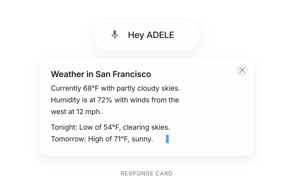
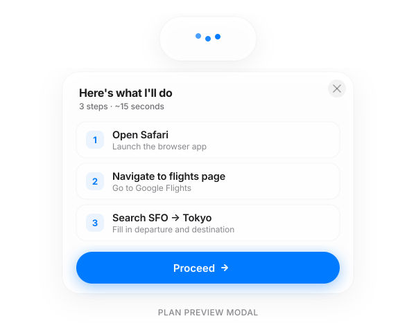
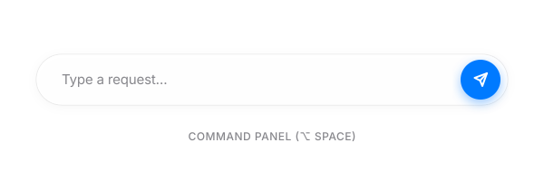
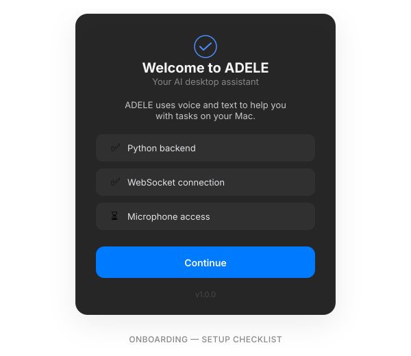
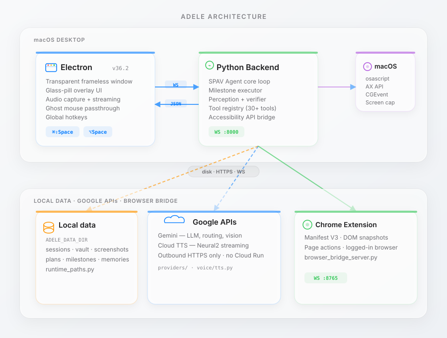

# ADELE

ADELE is a memory-aware automation companion with two product surfaces:

- **ADELE Desktop**: the current Electron app with a local Python backend, Chrome extension bridge, desktop tools, and local-first memory.
- **ADELE Web**: the planned web companion with browser automation through its own Chrome extension and a cloud memory vault users can inspect, edit, reset, and back up.

This repository is being normalized into a monorepo so the desktop app, web app, web extension, shared packages, and product documentation can evolve together without mixing responsibilities.

<p align="center">
  
</p>

## Why ADELE

Computer work often turns a simple goal into many small steps: open tabs, find fields, copy text, compare pages, fill forms, organize files, and check whether the result is correct.

ADELE turns those workflows into natural conversation. A user describes the goal, ADELE senses context, creates a plan, acts through browser or desktop tools, and verifies the result.

## Product Tracks

| Track | Surface | Status |
| --- | --- | --- |
| Desktop | Electron app, Python backend, desktop automation, Chrome extension bridge | Existing app moved to `apps/desktop` |
| Web | Web companion, cloud memory vault, web Chrome extension, MCP/Composio connections | Planned under `apps/web`, `apps/web-extension`, and `packages/*` |
| Landing | Public marketing/demo site | Existing site moved to `apps/landing` |

## Current Features

- Voice and text control through the desktop command surface.
- SPAV agent loop: Sense, Plan, Act, Verify.
- Browser automation through a Chrome extension bridge that can read pages, find elements, click, type, fill forms, and extract data.
- Desktop automation through screenshots, keyboard and mouse control, app launching, and platform tools.
- Local-first memory for sessions, plans, screenshots, milestones, and user preferences.
- Hybrid model routing across hosted Gemini-compatible APIs and local OpenAI-compatible runtimes such as Ollama.
- Verification layer for UI-changing actions through DOM changes, screenshots, and tool success signals.

## UI States

The desktop glass pill morphs between four states:

<table>
<tr>
<td align="center"><strong>Idle</strong><br/><br/><code>220px</code> - mic icon + "Hey ADELE"</td>
<td align="center"><strong>Listening</strong><br/><br/><code>440px</code> - typewriter transcription</td>
</tr>
<tr>
<td align="center"><strong>Thinking</strong><br/><br/><code>140px</code> - bouncing dots</td>
<td align="center"><strong>Doing</strong><br/><br/><code>320px</code> - spinner + app icon + action</td>
</tr>
</table>

### Response Card and Plan Preview

<table>
<tr>
<td align="center"><br/><strong>Streaming response card</strong><br/>Markdown, math, and code blocks</td>
<td align="center"><br/><strong>Plan preview modal</strong><br/>Step-by-step with approval controls</td>
</tr>
</table>

### Command Panel and Onboarding

<table>
<tr>
<td align="center"><br/><strong>Command panel</strong><br/>Type-to-prompt with send button</td>
<td align="center"><br/><strong>First-launch onboarding</strong><br/>Provider setup and keyboard shortcuts</td>
</tr>
</table>

## Architecture

<p align="center">
  
</p>

<p align="center">
  
</p>

ADELE has three main action surfaces today:

| Surface | What it does |
| --- | --- |
| Browser DOM | Reads pages, finds elements, clicks, types, selects, extracts structured data |
| Desktop UI | Uses screenshots, accessibility, keyboard, mouse, app launching, and visual targeting |
| Files/system | Reads, writes, organizes, searches, and runs local workflow commands |

## Quick Start

Install workspace dependencies from the repository root:

```bash
npm install
```

Run ADELE Desktop:

```bash
npm run desktop:start
```

### Build Week AI connection

ADELE Desktop uses **ChatGPT sign-in through Codex App Server** and requires **GPT-5.6**. Install Codex first, start Adele, then select **Continue with ChatGPT** in onboarding. Adele never stores a ChatGPT password or token and does not provide a main-LLM API-key field.

Prepare the desktop Python backend:

```powershell
cd apps\desktop
python -m venv .venv
.\.venv\Scripts\python.exe -m pip install --upgrade pip setuptools wheel
.\.venv\Scripts\python.exe -m pip install -r backend\requirements-dev.txt
```

Run the landing site:

```bash
npm run landing:dev
```

Package the desktop browser bridge:

```bash
npm run desktop:dist:extension
```

## Environment

The active Desktop LLM connection is ChatGPT through Codex App Server. The only supported developer override is `ADELE_CODEX_EXECUTABLE`, which can point to a local Codex executable. Adele does not read a ChatGPT token, and no provider-selection or main-LLM API-key setting is used.

## Chrome Extension

The desktop browser bridge lives in `apps/desktop/chrome_extension`.

1. Open `chrome://extensions`.
2. Enable **Developer mode**.
3. Choose **Load unpacked** and select `apps/desktop/chrome_extension`.
4. Open extension options and set the bridge URL/auth token if needed.

The web product will get its own extension under `apps/web-extension` during Track B.

## Project Structure

```text
adele/
  apps/
    desktop/                 Electron desktop app and Python backend
      main.js
      preload.js
      renderer/
      backend/
      chrome_extension/
      build/
      scripts/
      tests/
      benchmarks/
    landing/                 Existing landing site
    web/                     Planned ADELE Web app
    web-extension/           Planned ADELE Web browser automation extension
  packages/                  Planned shared contracts, memory, auth, and tooling
  docs/                      Guides, diagrams, screenshots, and submission notes
  package.json               Root npm workspace scripts
```

## Root Commands

| Command | Purpose |
| --- | --- |
| `npm run desktop:start` | Launch the desktop Electron app from `apps/desktop` |
| `npm run desktop:build:win` | Build the Windows installer |
| `npm run desktop:build:win:portable` | Build a portable Windows desktop artifact |
| `npm run desktop:dist:extension` | Package the desktop Chrome extension |
| `npm run landing:dev` | Run the landing site dev server |
| `npm run landing:build` | Build the landing site |
| `npm run web:dev` | Placeholder for the future web app |
| `npm run web-extension:build` | Placeholder for the future web extension |

## Testing

Desktop Python tests are still run from the desktop app context:

```bash
cd apps/desktop
.venv/Scripts/python.exe -m pytest tests/test_gemini_provider.py tests/test_agent_schema.py
.venv/Scripts/python.exe benchmarks/run_benchmarks.py
```

## Building

```bash
npm run desktop:build:win
npm run desktop:build:win:portable
npm run desktop:build:mac
```

The full Windows installer build also needs the prepared Python runtime bundle under `apps/desktop/build/python/win-x64` and the offline wheelhouse under `apps/desktop/wheelhouse`.

## Docs

- [Docs Index](docs/README.md)
- [Desktop Guide](docs/desktop/GUIDE.md)
- [Architecture Notes](docs/architecture/README.md)
- [Web Plan](docs/web/README.md)
- [Hackathon Submission Plan](docs/submission/HACKATHON_SUBMISSION.md)
- [Codex App Server Integration](docs/CODEX_APP_SERVER_INTEGRATION.md)
- [Build Week Desktop Setup](docs/BUILD_WEEK_DESKTOP_SETUP.md)
- [Security and Privacy](docs/ADELE_SECURITY_AND_PRIVACY.md)
- [Build Week Demo](docs/BUILD_WEEK_DEMO.md)

## License

MIT

---

<p align="center">
  <strong>ADELE</strong><br/>
  <sub>Desktop automation today. Web companion and cloud memory next.</sub>
</p>
